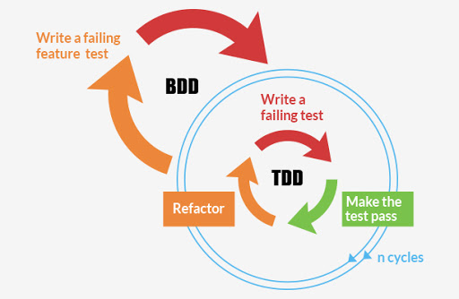

# Testable Clean Code

_부제: TBD + BDD + TDD + Function Compostion 로 테스트 가능한 클린 코드 베이스 유지하기_

 

 

[TDD 스터디에서 발표했던 PPT](https://docs.google.com/presentation/d/1GU6EGQIFmo824UVz_w54ktVb4jkhXNAHd7xVj_FQYZ4/edit#slide=id.g4964e676f0_0_4)

[Trello 칸반보드 가기 >>>>>](https://trello.com/b/fxhhYC18/testable-clean-codes)

목차 

* 도구 및 설정 (Tools & Configuration)

* 워크플로우 (Workflow / v1.0.0)

* 회고 (Retrospective)

* 구축 과제 (Todo / v2.0.0)

    * Database Seeder Cli Tool

 

### 1. 도구 및 설정 (Tools & Configuration)

 

🚩 &nbsp; **_Tools_** :   

* Testing Tool은 크게 Jest와 Cypress를 사용함

* Front End Test는 Selenium을 사용하다 Cypress로 전환하였으며, 엄밀한 의미의 BDD보다는 작업 증명을 위한 사후 테스트 용도로 사용하고 있음

* Backend API Test시 아래와 같은 플러그인, 라이브러리, 트랜스파일러 등을 함께 사용함

    * 모킹 라이브러리: jest-mock-extended

    * e2e 테스트 러너: supertest
 
    * 트랜스파일러: ts-jest

 

🚩 &nbsp; **_Configuration_** :   

* Typescript 환경 하에서 Jest 테스트를 진행하는 방법은 아래의 두가지가 있음

    * 소스코드와 테스트 코드를 트랜스파일링 한 이후 node 기반으로 테스트하기 

    * ts-jest로 인메모리(?) 트랜스파일링과 테스트를 동시 진행하기

* typeorm 사용시 스키마 관련 메타데이터의 트랜스파일링 설정이 까다로운 관계로 위의 두번째 방법을 선택함

* 컴포넌트 의존성이 한눈에 잘 드러날 수 있도록 moduleNameMapper로 modlue alias를 이용함 

* Integration Test시 테스트에 필요한 Data Seeding을 위해 setupFilesAfterEnv 설정을 이용함

* Cypress와 Jest를 함께 사용하는 경우 충돌 방지를 위해 TestIgnorePatterns 설정으로 Cypress 테스트 파일을 제외할 필요가 있음

 

### 2. 워크플로우 (Tools & Configuration)

 

🚩 &nbsp; **_Frontend 개발 워크플로우_** :

* step 1-1: TBD (예광탄 개발)

    * 하드코딩 렌더링 테스트

    * 렌더링 함수 분리

    * 컴포넌트 추출

    * MockApi (메모리 객체)-> FakeApi (Json) -> Api (Ajax Request) 순으로 Api 인터페이스 추상화

    * 하위 컴포넌트에 EventHandling 로직 추가

    * 루트 컴포넌트에 상태 관리 및 Fetch 로직 추가

* 1-2: BDD

    * Cypress 테스트를 사용하되, 엄밀한 의미의 BDD 보다는 작업 증명, 동작 테스트 등의 사후 테스트로 활용함

    * BDD 보다는 사후 테스트를 하는 주된 이유는 기획에 유연성을 보장하기 위함임

 

🚩 &nbsp; **_Backend 개발 워크플로우_** :  

* 2-1: TBD (예광탄 개발)

    * 백엔드 Api 개발은 어느 정도 정형화되어 있으므로 아래의 경우에만 예광탄 개발을 실시함 

        * 최초 Scaffolding 시

        * 코드 구조에 큰 변경이 있는 경우

* 2-2: BDD

    * 프론트엔드와 마찬가지로 e2e 테스트는 기획에 유연성을 보장하기 위함 BDD 보다는 사후 테스트로 주로 이용함

* 2-3: TDD

    * 2-2-1: Unit Test (outside-in) -> 유닛 테스트는 아래의 순서로 작성함

        * Routing Test

        * Controller Test

        * Service Test

        * DB Operation Test

        * DB Adaptor Test

    * 2-2-2: Integration Test (inside-out) -> 통합 테스트는 Unit 테스트의 반대 순서로 작성함

        * DB Adaptor Test

        * DB Operation Test

        * Service Test

        * Controller Test

        * Routing Test

 

### 3. 회고 (Retrospective)

* Unit 테스트와 Integration 테스트를 작성하니, 큰 고민없이 위의 순서에 맞춰 기계적으로 코딩 작업을 할 수 있었음

* Testable 가능한 코드 베이스를 유지하는데 가장 도움이 되는 코딩 스타일은 Function Composition임

* Function Composition외에도 Class 메소드를 컨텍스트를 주고받는 작은 함수들로 분리하는 것이 코드의 복잡성을 줄이는 데 큰 도움이 되었음

* Cucumber 라이브러리를 사용해 보았으나, 다양한 기능과 유스케이스가 구비되지 않는 한, 통합테스트만으로 충분하다는 결론을 얻음

 

### 3. 구축 과제 (Todo)

 

⛰ &nbsp; **_Database Seeder Cli Tool_** :   

* 테스트에 필요한 초기 Seed들을 랜덤하게 생성하는 Helper 메서드들은 구현 완료됨

* e2e Test Database와 Production Database에 원하는 구성의 seed들을 시뮬레이팅 할 수 있도록 Helper 메서드들의 고도화를 추진할 예정o

* 아울러 Cli Tool 제작 라이브러리의 도움을 받아 완성된 seed 메서드들을 좀더 간편하게 사용할 수 있는 Cli Tool 제작을 구상하고 있음

 

